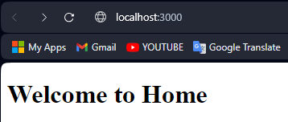
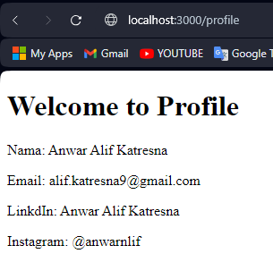
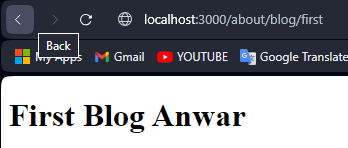
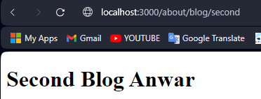

|  | Pemrograman Berbasis Framework 2024 |
|--|--|
| NIM |  2341728026|
| Nama |  Anwar Alif Katresna |
| Kelas | TI - 3A 

## Pratikum 1

## Pratikum 2

> Pertanyaan: Apa kekurangan yang mungkin terjadi jika menggunakan pendekatan pada Praktikum 2 untuk menangani routing?   
Routing url static membuat url  cabang menjadi panjang dan ribet